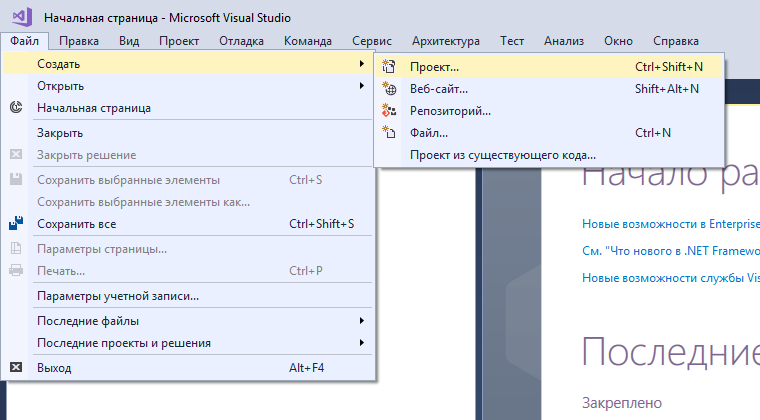
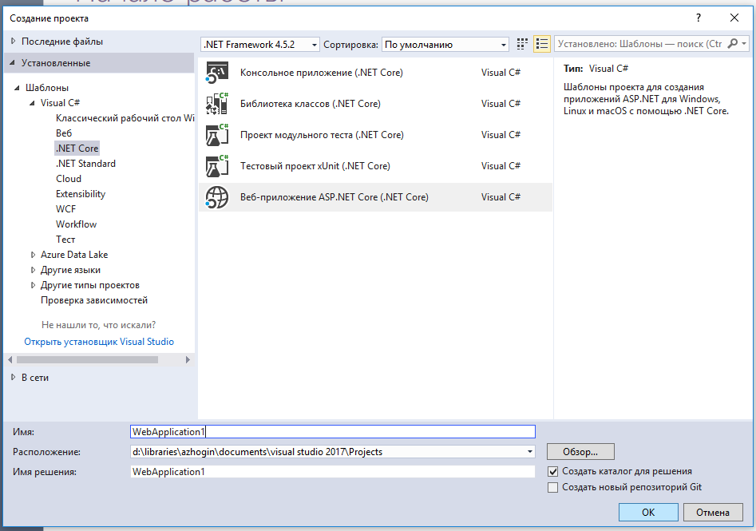
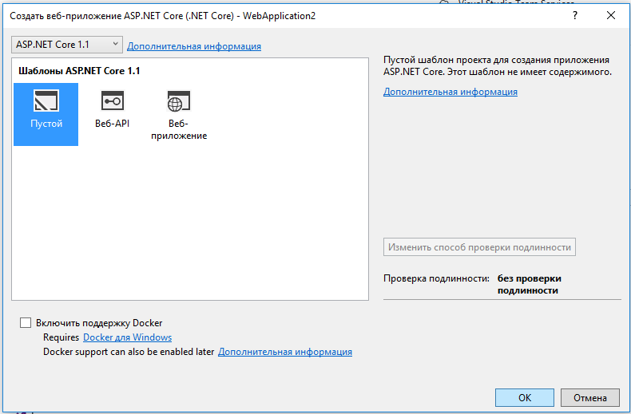

# Использование Adeptik.AspNet.Angular для MSBuild

Расширение Adeptik.AspNet.Angular для MSBuild представляет собой набор файлов targets и props, распространяемые посредством NuGet.

## Создание нового проекта ASP.NET Core с фронтэндом Angular

### 1. Создать проект в Visual Studio 2017.

1.1.

1.2.

1.3.

### 2. Настроить проект.

  2.1. Открыть исходный код файла `.csproj`

  

  2.2. Для корректного отображения элементов в "Обозревателе решения" необходимо заменить включение папки `wwwroot`

    <ItemGroup>
      <Folder Include="wwwroot\" />
    </ItemGroup>
  
  на

    <ItemGroup>
      <None Remove="Angular\**" />
      <None Include="Angular\**" Exclude="Angular\node_modules\**;Angular\.gitignore" />
    </ItemGroup>
  
  Здесь, Angular - путь к папке с исходным кодом фронтэнда Angular. Задание пути к данной папке должно осуществляться относительно корня проекта без использование свойств MSBuild, т.к. Visual Studio только в таком виде корректно воспринимает включение элементов в "Обозревателе решения".

  2.3. Отключить сборку TypeScript

    <PropertyGroup>
      <TypeScriptCompileBlocked>true</TypeScriptCompileBlocked>
    </PropertyGroup>

  2.4. Настроить параметры сборки Angular путем задания свойств MSBuild. [Список свойств сборки Angular](Properties.md).
  
  2.5. Добавить зависимость NuGet Adeptik.AspNet.Angular.

    <ItemGroup>
      <PackageReference Include="Adeptik.AspNet.Angular" Version="1.0.0" />
    </ItemGroup>

  2.6. Сохранить изменения в файле `.csproj`.

### 3. Восстановить пакеты.

После сохранения изменений в файле `.csproj` Visual Studio запустит процесс восстановления пакетов NuGet. Если этого не произошло, то необходимо в папке проекта выполнить команду

    dotnet restore

### 4. Собрать решение.

Собрать решение в Visual Studio.